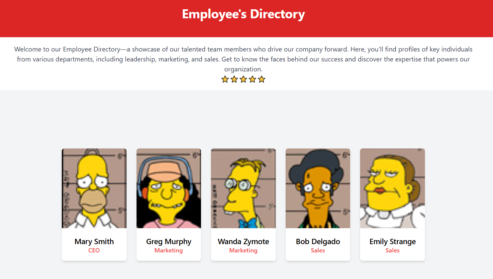

# Gohetia_Sheldon_Dynamic_PHP_Page

## Hello Welcome to my Project!

This project showcases a dynamic employee profile repository built using PHP and MySQL. It allows users to browse through an organized collection of employee profiles, each with detailed information such as job title, name, and profile image. By leveraging MySQL, the project retrieves employee data stored in a relational database, and PHP is used to dynamically render the content on the webpage. The employee profiles are displayed in a user-friendly layout, enabling users to explore key individuals across different departments. The system also supports a detailed view for each employee, providing a comprehensive look at their role and background. This project demonstrates the power of PHP and MySQL in building dynamic, data-driven websites for organizing and displaying employee information efficiently.

## Assignment Rubric

- Create a dynamic PHP page using the given files including the SQL database file from FOL.
- Create page layout using html, CSS or tailwind. Responsiveness is option to this assignment.
- Retrieve the necessary information base on your understanding and knowledge gained from the class.
- Make sure to retrieve the correct information of each employees.
- Feel free to add more style and spices of the page.

## Final Deliverable

- Added a file called main.css for some custom css and a combination of tailwind.
- Added new column field for employees in the database called "role". Updated SQL file added to the assets folder.
- Added INNER JOIN clause/script in my sql query in order for me to connect the employees table to the jobs table using employees.job_id = jobs.id. This ensures me that the correct job title is associated with each employee.
- Added a LIMIT clause/script to limit my data to 5 to avoid redundancy.

## Installation

To run the project locally:

- Clone this repository
- Navigate into the project directory:
- Open the index.html file in your browser, or if using a local server, start the server and navigate to localhost to view.
- Ensure the project folder is placed in the appropriate directory of your local server's root. For example, in WAMP, it should be in wamp64/www/, and in MAMP, it should be in the htdocs folder.

## Usage

Using a local server, start the server and navigate to localhost to view.

## History

No history is required

## Credits

Sheldon P. Gohetia

## License

MIT - see license file for more information.
